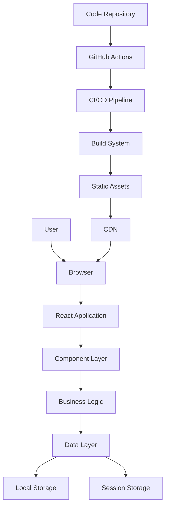
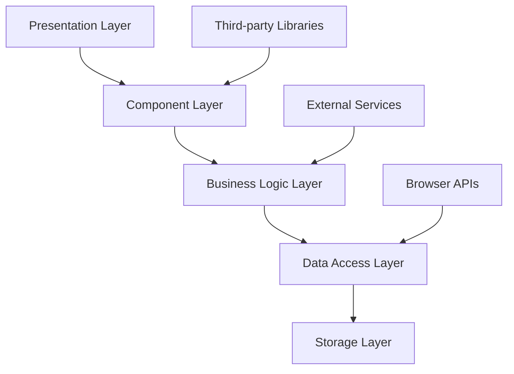
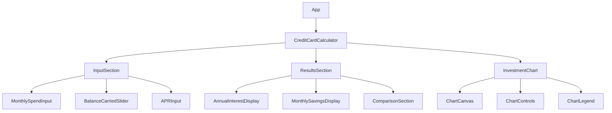
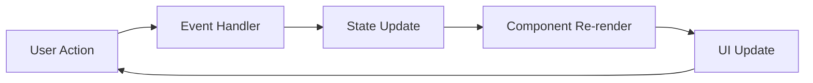
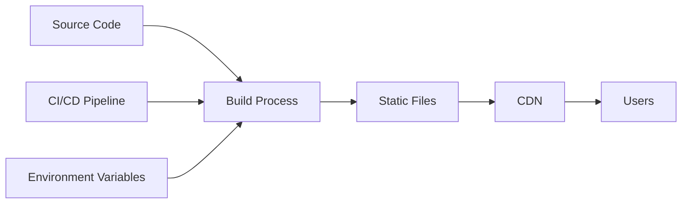

# 🏗️ Architecture Guide

This document provides a comprehensive overview of the LifeSmart Calculator's technical architecture, design patterns, and system components.

## Table of Contents

- [System Overview](#system-overview)
- [Technology Stack](#technology-stack)
- [Application Architecture](#application-architecture)
- [Component Architecture](#component-architecture)
- [Data Flow](#data-flow)
- [State Management](#state-management)
- [Performance Architecture](#performance-architecture)
- [Security Architecture](#security-architecture)
- [Deployment Architecture](#deployment-architecture)
- [Monitoring and Observability](#monitoring-and-observability)
- [Scalability Considerations](#scalability-considerations)

---

## System Overview

### High-Level Architecture



### System Characteristics

- **Type**: Single Page Application (SPA)
- **Architecture Pattern**: Component-Based Architecture
- **Deployment Model**: Static Site Generation
- **Data Persistence**: Client-Side Only
- **Communication**: No Backend API Required
- **Scalability**: Horizontal via CDN

---

## Technology Stack

### Frontend Technologies

#### Core Framework
- **React 19.2.0** - Component-based UI library
- **TypeScript 4.9.5** - Type-safe JavaScript
- **Create React App 5.0.1** - Build tooling and development environment

#### Styling and UI
- **Tailwind CSS 3.4.18** - Utility-first CSS framework
- **Custom CSS** - Component-specific styles
- **Responsive Design** - Mobile-first approach

#### Data Visualization
- **Chart.js 4.5.0** - Charting library
- **react-chartjs-2 5.3.0** - React wrapper for Chart.js

#### Development Tools
- **ESLint** - Code linting
- **Prettier** - Code formatting
- **Jest** - Unit testing
- **React Testing Library** - Component testing
- **Playwright** - End-to-end testing

### Build and Deployment

#### Build System
- **Webpack** - Module bundler (via CRA)
- **Babel** - JavaScript transpiler
- **PostCSS** - CSS processing
- **Autoprefixer** - CSS vendor prefixing

#### Deployment Platforms
- **Vercel** - Primary hosting platform
- **Netlify** - Alternative hosting
- **GitHub Pages** - Static site hosting
- **Docker** - Containerized deployment

#### CI/CD
- **GitHub Actions** - Continuous integration
- **Automated Testing** - Unit, integration, E2E
- **Security Scanning** - Dependency and code analysis
- **Performance Monitoring** - Lighthouse CI

---

## Application Architecture

### Layered Architecture



#### Layer Responsibilities

1. **Presentation Layer**
   - User interface components
   - User interactions
   - Visual feedback

2. **Component Layer**
   - Reusable UI components
   - Component composition
   - Props and state management

3. **Business Logic Layer**
   - Calculation algorithms
   - Data validation
   - Business rules

4. **Data Access Layer**
   - Data persistence
   - Data retrieval
   - Data transformation

5. **Storage Layer**
   - Local storage
   - Session storage
   - Memory storage

### Module Organization

```
src/
├── components/          # UI Components
│   ├── CreditCardCalculator.tsx
│   └── InvestmentChart.tsx
├── hooks/              # Custom Hooks
│   ├── useLocalStorage.ts
│   └── useDebounce.ts
├── utils/              # Utility Functions
│   ├── calculations.ts
│   ├── formatters.ts
│   └── validators.ts
├── types/              # Type Definitions
│   ├── calculator.ts
│   ├── chart.ts
│   └── common.ts
├── constants/          # Application Constants
│   ├── defaults.ts
│   └── limits.ts
├── config/             # Configuration
│   ├── environment.ts
│   └── chart.ts
└── styles/             # Global Styles
    ├── globals.css
    └── components.css
```

---

## Component Architecture

### Component Hierarchy



### Component Design Patterns

#### 1. Container/Presentational Pattern

```typescript
// Container Component (Smart Component)
const CreditCardCalculator: React.FC = () => {
  const [state, setState] = useState(initialState);
  const [calculations, setCalculations] = useState(null);
  
  const handleInputChange = (field: string, value: number) => {
    // Business logic
    const newState = { ...state, [field]: value };
    setState(newState);
    
    // Calculate results
    const results = calculateResults(newState);
    setCalculations(results);
  };
  
  return (
    <CalculatorUI
      state={state}
      calculations={calculations}
      onInputChange={handleInputChange}
    />
  );
};

// Presentational Component (Dumb Component)
interface CalculatorUIProps {
  state: CalculatorState;
  calculations: CalculationResults;
  onInputChange: (field: string, value: number) => void;
}

const CalculatorUI: React.FC<CalculatorUIProps> = ({
  state,
  calculations,
  onInputChange
}) => {
  return (
    <div className="calculator">
      {/* UI rendering */}
    </div>
  );
};
```

#### 2. Higher-Order Component (HOC) Pattern

```typescript
// HOC for error handling
const withErrorBoundary = <P extends object>(
  Component: React.ComponentType<P>
) => {
  return class extends React.Component<P, { hasError: boolean }> {
    constructor(props: P) {
      super(props);
      this.state = { hasError: false };
    }
    
    static getDerivedStateFromError(error: Error) {
      return { hasError: true };
    }
    
    componentDidCatch(error: Error, errorInfo: React.ErrorInfo) {
      console.error('Error caught by boundary:', error, errorInfo);
    }
    
    render() {
      if (this.state.hasError) {
        return <ErrorFallback />;
      }
      
      return <Component {...this.props} />;
    }
  };
};

// Usage
const CalculatorWithErrorBoundary = withErrorBoundary(CreditCardCalculator);
```

#### 3. Render Props Pattern

```typescript
// Render props for data fetching
interface DataFetcherProps {
  children: (data: any, loading: boolean, error: string | null) => React.ReactNode;
  url: string;
}

const DataFetcher: React.FC<DataFetcherProps> = ({ children, url }) => {
  const [data, setData] = useState(null);
  const [loading, setLoading] = useState(true);
  const [error, setError] = useState<string | null>(null);
  
  useEffect(() => {
    fetch(url)
      .then(response => response.json())
      .then(data => {
        setData(data);
        setLoading(false);
      })
      .catch(err => {
        setError(err.message);
        setLoading(false);
      });
  }, [url]);
  
  return <>{children(data, loading, error)}</>;
};

// Usage
<DataFetcher url="/api/data">
  {(data, loading, error) => (
    loading ? <Spinner /> :
    error ? <ErrorMessage error={error} /> :
    <DataDisplay data={data} />
  )}
</DataFetcher>
```

### Component Communication

#### 1. Props Down, Events Up

```typescript
// Parent component passes data down
const ParentComponent: React.FC = () => {
  const [data, setData] = useState(initialData);
  
  const handleDataChange = (newData: Data) => {
    setData(newData);
  };
  
  return (
    <ChildComponent
      data={data}
      onDataChange={handleDataChange}
    />
  );
};

// Child component emits events up
interface ChildComponentProps {
  data: Data;
  onDataChange: (data: Data) => void;
}

const ChildComponent: React.FC<ChildComponentProps> = ({
  data,
  onDataChange
}) => {
  const handleClick = () => {
    onDataChange(updatedData);
  };
  
  return <button onClick={handleClick}>Update</button>;
};
```

#### 2. Context API for Global State

```typescript
// Context definition
interface AppContextType {
  theme: 'light' | 'dark';
  setTheme: (theme: 'light' | 'dark') => void;
  user: User | null;
  setUser: (user: User | null) => void;
}

const AppContext = createContext<AppContextType | undefined>(undefined);

// Context provider
export const AppProvider: React.FC<{ children: React.ReactNode }> = ({
  children
}) => {
  const [theme, setTheme] = useState<'light' | 'dark'>('light');
  const [user, setUser] = useState<User | null>(null);
  
  const value = useMemo(() => ({
    theme,
    setTheme,
    user,
    setUser
  }), [theme, user]);
  
  return (
    <AppContext.Provider value={value}>
      {children}
    </AppContext.Provider>
  );
};

// Custom hook for using context
export const useApp = () => {
  const context = useContext(AppContext);
  if (context === undefined) {
    throw new Error('useApp must be used within an AppProvider');
  }
  return context;
};
```

---

## Data Flow

### Unidirectional Data Flow



### Data Flow Patterns

#### 1. Local State Management

```typescript
// Component-level state
const CalculatorComponent: React.FC = () => {
  const [monthlySpend, setMonthlySpend] = useState(2000);
  const [apr, setApr] = useState(23);
  const [results, setResults] = useState(null);
  
  // Derived state
  const annualInterest = useMemo(() => {
    return calculateAnnualInterest(monthlySpend, apr);
  }, [monthlySpend, apr]);
  
  // Effect for side effects
  useEffect(() => {
    const newResults = calculateResults({ monthlySpend, apr });
    setResults(newResults);
  }, [monthlySpend, apr]);
  
  return (
    <div>
      <input
        value={monthlySpend}
        onChange={(e) => setMonthlySpend(Number(e.target.value))}
      />
      <div>Annual Interest: ${annualInterest}</div>
    </div>
  );
};
```

#### 2. Context-Based State Management

```typescript
// Global state management
const CalculatorProvider: React.FC<{ children: React.ReactNode }> = ({
  children
}) => {
  const [calculatorState, setCalculatorState] = useState(initialState);
  
  const updateCalculator = useCallback((updates: Partial<CalculatorState>) => {
    setCalculatorState(prev => ({ ...prev, ...updates }));
  }, []);
  
  const value = useMemo(() => ({
    state: calculatorState,
    updateCalculator
  }), [calculatorState, updateCalculator]);
  
  return (
    <CalculatorContext.Provider value={value}>
      {children}
    </CalculatorContext.Provider>
  );
};
```

#### 3. Custom Hooks for State Logic

```typescript
// Custom hook for calculator logic
const useCalculator = (initialState: CalculatorState) => {
  const [state, setState] = useState(initialState);
  const [results, setResults] = useState<CalculationResults | null>(null);
  
  const updateState = useCallback((updates: Partial<CalculatorState>) => {
    setState(prev => ({ ...prev, ...updates }));
  }, []);
  
  const calculate = useCallback(() => {
    const newResults = calculateResults(state);
    setResults(newResults);
  }, [state]);
  
  useEffect(() => {
    calculate();
  }, [calculate]);
  
  return {
    state,
    results,
    updateState,
    calculate
  };
};
```

---

## State Management

### State Management Patterns

#### 1. useState for Local State

```typescript
// Simple state
const [count, setCount] = useState(0);

// Complex state
const [formData, setFormData] = useState({
  monthlySpend: 2000,
  apr: 23,
  timePeriod: 10
});

// State with initializer function
const [data, setData] = useState(() => {
  const saved = localStorage.getItem('calculator-data');
  return saved ? JSON.parse(saved) : initialData;
});
```

#### 2. useReducer for Complex State

```typescript
// State interface
interface CalculatorState {
  monthlySpend: number;
  apr: number;
  timePeriod: number;
  results: CalculationResults | null;
  isLoading: boolean;
  error: string | null;
}

// Action types
type CalculatorAction =
  | { type: 'SET_MONTHLY_SPEND'; payload: number }
  | { type: 'SET_APR'; payload: number }
  | { type: 'SET_TIME_PERIOD'; payload: number }
  | { type: 'CALCULATE_START' }
  | { type: 'CALCULATE_SUCCESS'; payload: CalculationResults }
  | { type: 'CALCULATE_ERROR'; payload: string };

// Reducer function
const calculatorReducer = (
  state: CalculatorState,
  action: CalculatorAction
): CalculatorState => {
  switch (action.type) {
    case 'SET_MONTHLY_SPEND':
      return { ...state, monthlySpend: action.payload };
    case 'SET_APR':
      return { ...state, apr: action.payload };
    case 'SET_TIME_PERIOD':
      return { ...state, timePeriod: action.payload };
    case 'CALCULATE_START':
      return { ...state, isLoading: true, error: null };
    case 'CALCULATE_SUCCESS':
      return { ...state, isLoading: false, results: action.payload };
    case 'CALCULATE_ERROR':
      return { ...state, isLoading: false, error: action.payload };
    default:
      return state;
  }
};

// Usage
const [state, dispatch] = useReducer(calculatorReducer, initialState);
```

#### 3. Custom Hooks for State Logic

```typescript
// Custom hook for form state
const useForm = <T>(initialValues: T) => {
  const [values, setValues] = useState<T>(initialValues);
  const [errors, setErrors] = useState<Partial<Record<keyof T, string>>>({});
  const [touched, setTouched] = useState<Partial<Record<keyof T, boolean>>>({});
  
  const setValue = useCallback((field: keyof T, value: T[keyof T]) => {
    setValues(prev => ({ ...prev, [field]: value }));
  }, []);
  
  const setError = useCallback((field: keyof T, error: string) => {
    setErrors(prev => ({ ...prev, [field]: error }));
  }, []);
  
  const setFieldTouched = useCallback((field: keyof T) => {
    setTouched(prev => ({ ...prev, [field]: true }));
  }, []);
  
  const reset = useCallback(() => {
    setValues(initialValues);
    setErrors({});
    setTouched({});
  }, [initialValues]);
  
  return {
    values,
    errors,
    touched,
    setValue,
    setError,
    setFieldTouched,
    reset
  };
};
```

### Data Persistence

#### 1. Local Storage

```typescript
// Custom hook for localStorage
const useLocalStorage = <T>(key: string, initialValue: T) => {
  const [storedValue, setStoredValue] = useState<T>(() => {
    try {
      const item = window.localStorage.getItem(key);
      return item ? JSON.parse(item) : initialValue;
    } catch (error) {
      console.error(`Error reading localStorage key "${key}":`, error);
      return initialValue;
    }
  });
  
  const setValue = useCallback((value: T | ((val: T) => T)) => {
    try {
      const valueToStore = value instanceof Function ? value(storedValue) : value;
      setStoredValue(valueToStore);
      window.localStorage.setItem(key, JSON.stringify(valueToStore));
    } catch (error) {
      console.error(`Error setting localStorage key "${key}":`, error);
    }
  }, [key, storedValue]);
  
  return [storedValue, setValue] as const;
};
```

#### 2. Session Storage

```typescript
// Custom hook for sessionStorage
const useSessionStorage = <T>(key: string, initialValue: T) => {
  const [storedValue, setStoredValue] = useState<T>(() => {
    try {
      const item = window.sessionStorage.getItem(key);
      return item ? JSON.parse(item) : initialValue;
    } catch (error) {
      console.error(`Error reading sessionStorage key "${key}":`, error);
      return initialValue;
    }
  });
  
  const setValue = useCallback((value: T | ((val: T) => T)) => {
    try {
      const valueToStore = value instanceof Function ? value(storedValue) : value;
      setStoredValue(valueToStore);
      window.sessionStorage.setItem(key, JSON.stringify(valueToStore));
    } catch (error) {
      console.error(`Error setting sessionStorage key "${key}":`, error);
    }
  }, [key, storedValue]);
  
  return [storedValue, setValue] as const;
};
```

---

## Performance Architecture

### Performance Optimization Strategies

#### 1. Code Splitting

```typescript
// Lazy loading components
const LazyChart = lazy(() => import('./InvestmentChart'));

// Route-based code splitting
const CalculatorPage = lazy(() => import('./pages/CalculatorPage'));
const AboutPage = lazy(() => import('./pages/AboutPage'));

// Usage with Suspense
const App: React.FC = () => {
  return (
    <Suspense fallback={<LoadingSpinner />}>
      <Router>
        <Routes>
          <Route path="/" element={<CalculatorPage />} />
          <Route path="/about" element={<AboutPage />} />
        </Routes>
      </Router>
    </Suspense>
  );
};
```

#### 2. Memoization

```typescript
// React.memo for component memoization
const ExpensiveComponent = React.memo<Props>(({ data, onUpdate }) => {
  return (
    <div>
      {data.map(item => (
        <div key={item.id}>{item.name}</div>
      ))}
    </div>
  );
}, (prevProps, nextProps) => {
  // Custom comparison function
  return prevProps.data.length === nextProps.data.length;
});

// useMemo for expensive calculations
const ExpensiveCalculation: React.FC<Props> = ({ data }) => {
  const expensiveValue = useMemo(() => {
    return data.reduce((sum, item) => sum + item.value, 0);
  }, [data]);
  
  return <div>{expensiveValue}</div>;
};

// useCallback for event handlers
const ParentComponent: React.FC<Props> = ({ items }) => {
  const handleItemClick = useCallback((id: string) => {
    // Handle click
  }, []);
  
  return (
    <div>
      {items.map(item => (
        <ItemComponent
          key={item.id}
          item={item}
          onClick={handleItemClick}
        />
      ))}
    </div>
  );
};
```

#### 3. Virtual Scrolling

```typescript
// Virtual scrolling for large lists
const VirtualList: React.FC<VirtualListProps> = ({
  items,
  itemHeight,
  containerHeight
}) => {
  const [scrollTop, setScrollTop] = useState(0);
  
  const visibleItems = useMemo(() => {
    const startIndex = Math.floor(scrollTop / itemHeight);
    const endIndex = Math.min(
      startIndex + Math.ceil(containerHeight / itemHeight),
      items.length
    );
    
    return items.slice(startIndex, endIndex).map((item, index) => ({
      ...item,
      index: startIndex + index
    }));
  }, [items, itemHeight, containerHeight, scrollTop]);
  
  return (
    <div
      style={{ height: containerHeight, overflow: 'auto' }}
      onScroll={(e) => setScrollTop(e.currentTarget.scrollTop)}
    >
      <div style={{ height: items.length * itemHeight }}>
        {visibleItems.map(item => (
          <div
            key={item.id}
            style={{
              height: itemHeight,
              transform: `translateY(${item.index * itemHeight}px)`
            }}
          >
            {item.content}
          </div>
        ))}
      </div>
    </div>
  );
};
```

### Bundle Optimization

#### 1. Tree Shaking

```typescript
// Import only what you need
import { debounce } from 'lodash/debounce';
// Instead of: import _ from 'lodash';

// Use named imports
import { Chart, registerables } from 'chart.js';
// Instead of: import Chart from 'chart.js';
```

#### 2. Dynamic Imports

```typescript
// Dynamic imports for large libraries
const loadChart = async () => {
  const { Chart } = await import('chart.js');
  return Chart;
};

// Conditional loading
const ChartComponent: React.FC<Props> = ({ data, showChart }) => {
  const [Chart, setChart] = useState(null);
  
  useEffect(() => {
    if (showChart) {
      loadChart().then(setChart);
    }
  }, [showChart]);
  
  if (!Chart) return <div>Loading chart...</div>;
  
  return <Chart data={data} />;
};
```

#### 3. Bundle Analysis

```typescript
// Webpack bundle analyzer configuration
const BundleAnalyzerPlugin = require('webpack-bundle-analyzer').BundleAnalyzerPlugin;

module.exports = {
  plugins: [
    new BundleAnalyzerPlugin({
      analyzerMode: 'static',
      openAnalyzer: false,
      reportFilename: 'bundle-report.html'
    })
  ]
};
```

---

## Security Architecture

### Security Measures

#### 1. Input Validation

```typescript
// Input validation utilities
const validateInput = (value: string, type: 'number' | 'string'): boolean => {
  switch (type) {
    case 'number':
      return !isNaN(Number(value)) && Number(value) >= 0;
    case 'string':
      return typeof value === 'string' && value.length > 0;
    default:
      return false;
  }
};

// Sanitization
const sanitizeInput = (input: string): string => {
  return input
    .replace(/[<>]/g, '') // Remove HTML tags
    .replace(/[&"']/g, '') // Remove special characters
    .trim();
};
```

#### 2. XSS Prevention

```typescript
// Safe HTML rendering
const SafeHTML: React.FC<{ content: string }> = ({ content }) => {
  const sanitizedContent = DOMPurify.sanitize(content);
  return <div dangerouslySetInnerHTML={{ __html: sanitizedContent }} />;
};

// Content Security Policy
const cspMeta = document.createElement('meta');
cspMeta.setAttribute('http-equiv', 'Content-Security-Policy');
cspMeta.setAttribute('content', "default-src 'self'; script-src 'self' 'unsafe-inline'");
document.head.appendChild(cspMeta);
```

#### 3. Data Encryption

```typescript
// Client-side encryption for sensitive data
const encryptData = (data: string, key: string): string => {
  // Use Web Crypto API for encryption
  return btoa(data); // Base64 encoding (for demo)
};

const decryptData = (encryptedData: string, key: string): string => {
  return atob(encryptedData); // Base64 decoding (for demo)
};
```

### Security Headers

#### 1. HTTP Security Headers

```typescript
// Security headers configuration
const securityHeaders = {
  'X-Content-Type-Options': 'nosniff',
  'X-Frame-Options': 'DENY',
  'X-XSS-Protection': '1; mode=block',
  'Referrer-Policy': 'strict-origin-when-cross-origin',
  'Content-Security-Policy': "default-src 'self'; script-src 'self' 'unsafe-inline'"
};
```

#### 2. HTTPS Enforcement

```typescript
// Force HTTPS in production
if (process.env.NODE_ENV === 'production' && location.protocol !== 'https:') {
  location.replace('https:' + window.location.href.substring(window.location.protocol.length));
}
```

---

## Deployment Architecture

### Deployment Strategy

#### 1. Static Site Generation



#### 2. Multi-Platform Deployment

```typescript
// Deployment configuration
const deploymentConfig = {
  vercel: {
    buildCommand: 'npm run build',
    outputDirectory: 'build',
    environmentVariables: {
      REACT_APP_API_URL: process.env.REACT_APP_API_URL
    }
  },
  netlify: {
    buildCommand: 'npm run build',
    publishDirectory: 'build',
    environmentVariables: {
      REACT_APP_API_URL: process.env.REACT_APP_API_URL
    }
  }
};
```

#### 3. Environment Management

```typescript
// Environment configuration
const getEnvironmentConfig = () => {
  const env = process.env.NODE_ENV;
  
  switch (env) {
    case 'development':
      return {
        apiUrl: 'http://localhost:3001',
        debug: true,
        analytics: false
      };
    case 'staging':
      return {
        apiUrl: 'https://staging-api.example.com',
        debug: true,
        analytics: true
      };
    case 'production':
      return {
        apiUrl: 'https://api.example.com',
        debug: false,
        analytics: true
      };
    default:
      throw new Error(`Unknown environment: ${env}`);
  }
};
```

---

## Monitoring and Observability

### Performance Monitoring

#### 1. Web Vitals

```typescript
// Web Vitals monitoring
import { getCLS, getFID, getFCP, getLCP, getTTFB } from 'web-vitals';

const reportWebVitals = (onPerfEntry?: (metric: any) => void) => {
  if (onPerfEntry && onPerfEntry instanceof Function) {
    getCLS(onPerfEntry);
    getFID(onPerfEntry);
    getFCP(onPerfEntry);
    getLCP(onPerfEntry);
    getTTFB(onPerfEntry);
  }
};

export default reportWebVitals;
```

#### 2. Error Tracking

```typescript
// Error boundary for error tracking
class ErrorBoundary extends React.Component<Props, State> {
  constructor(props: Props) {
    super(props);
    this.state = { hasError: false, error: null };
  }
  
  static getDerivedStateFromError(error: Error): State {
    return { hasError: true, error };
  }
  
  componentDidCatch(error: Error, errorInfo: React.ErrorInfo) {
    // Send error to monitoring service
    console.error('Error caught by boundary:', error, errorInfo);
    
    // Example: Send to error tracking service
    // errorTrackingService.captureException(error, errorInfo);
  }
  
  render() {
    if (this.state.hasError) {
      return <ErrorFallback error={this.state.error} />;
    }
    
    return this.props.children;
  }
}
```

#### 3. Analytics

```typescript
// Analytics tracking
const trackEvent = (eventName: string, properties: Record<string, any>) => {
  if (process.env.REACT_APP_ENABLE_ANALYTICS === 'true') {
    // Send to analytics service
    console.log('Event tracked:', eventName, properties);
    
    // Example: Google Analytics
    // gtag('event', eventName, properties);
  }
};

// Usage
const handleButtonClick = () => {
  trackEvent('button_click', { button_name: 'calculate' });
  // Handle click
};
```

---

## Scalability Considerations

### Horizontal Scaling

#### 1. CDN Distribution

```typescript
// CDN configuration
const cdnConfig = {
  staticAssets: {
    baseUrl: 'https://cdn.example.com',
    cacheControl: 'public, max-age=31536000, immutable'
  },
  dynamicContent: {
    baseUrl: 'https://api.example.com',
    cacheControl: 'public, max-age=3600'
  }
};
```

#### 2. Load Balancing

```typescript
// Load balancing strategy
const loadBalancingStrategy = {
  roundRobin: true,
  healthChecks: true,
  failover: true,
  stickySessions: false
};
```

### Vertical Scaling

#### 1. Performance Optimization

```typescript
// Performance optimization strategies
const performanceOptimizations = {
  codeSplitting: true,
  lazyLoading: true,
  memoization: true,
  virtualScrolling: true,
  imageOptimization: true
};
```

#### 2. Caching Strategy

```typescript
// Caching strategy
const cachingStrategy = {
  browser: {
    staticAssets: '1 year',
    html: '1 hour',
    api: '5 minutes'
  },
  cdn: {
    staticAssets: '1 year',
    html: '1 hour'
  }
};
```

---

## Conclusion

The LifeSmart Calculator follows a modern, scalable architecture that prioritizes:

1. **Maintainability** - Clear separation of concerns and modular design
2. **Performance** - Optimized for speed and efficiency
3. **Security** - Built with security best practices
4. **Scalability** - Designed to handle growth and increased load
5. **Developer Experience** - Easy to develop, test, and deploy

This architecture provides a solid foundation for the current application and future enhancements while maintaining high performance and security standards.
