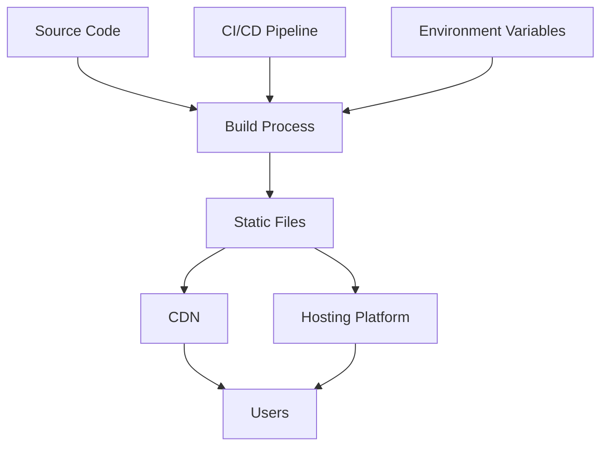

# 🚀 Deployment Guide

This comprehensive guide covers all deployment options for the LifeSmart Calculator application.

## Table of Contents

- [Overview](#overview)
- [Prerequisites](#prerequisites)
- [Build Process](#build-process)
- [Deployment Platforms](#deployment-platforms)
- [Environment Configuration](#environment-configuration)
- [CI/CD Deployment](#cicd-deployment)
- [Manual Deployment](#manual-deployment)
- [Docker Deployment](#docker-deployment)
- [Troubleshooting](#troubleshooting)
- [Performance Optimization](#performance-optimization)
- [Monitoring](#monitoring)

---

## Overview

The LifeSmart Calculator is a static React application that can be deployed to various platforms. This guide covers multiple deployment strategies from simple static hosting to advanced containerized deployments.

### Deployment Architecture



---

## Prerequisites

### Required Tools

- **Node.js** 18.0.0 or higher
- **npm** 8.0.0 or higher
- **Git** 2.0.0 or higher
- **Docker** (for containerized deployment)

### Optional Tools

- **Vercel CLI** - For Vercel deployment
- **Netlify CLI** - For Netlify deployment
- **AWS CLI** - For AWS deployment
- **Azure CLI** - For Azure deployment

---

## Build Process

### 1. Production Build

```bash
# Install dependencies
npm ci --production

# Run type checking
npm run type-check

# Run linting
npm run lint

# Run tests
npm test -- --coverage --watchAll=false

# Build for production
npm run build
```

### 2. Build Output

The build process creates a `build/` directory with:

```
build/
├── static/
│   ├── css/
│   │   └── main.[hash].css
│   ├── js/
│   │   ├── main.[hash].js
│   │   └── [chunk].[hash].js
│   └── media/
│       └── [assets]
├── index.html
├── manifest.json
├── robots.txt
└── sitemap.xml
```

### 3. Build Optimization

The production build includes:

- **Code Splitting** - Automatic code splitting for optimal loading
- **Tree Shaking** - Removal of unused code
- **Minification** - JavaScript and CSS minification
- **Compression** - Gzip compression for assets
- **Cache Busting** - Filename hashing for cache invalidation

---

## Deployment Platforms

### 1. Vercel (Recommended)

Vercel provides excellent performance and developer experience for React applications.

#### Automatic Deployment

1. **Connect Repository**
   - Go to [vercel.com](https://vercel.com)
   - Import your GitHub repository
   - Configure build settings

2. **Build Configuration**
   ```json
   {
     "buildCommand": "npm run build",
     "outputDirectory": "build",
     "installCommand": "npm ci",
     "framework": "create-react-app"
   }
   ```

3. **Environment Variables**
   - Add environment variables in Vercel dashboard
   - Configure for production, preview, and development

#### Manual Deployment

```bash
# Install Vercel CLI
npm i -g vercel

# Login to Vercel
vercel login

# Deploy
vercel

# Deploy to production
vercel --prod
```

#### Vercel Configuration

Create `vercel.json`:

```json
{
  "version": 2,
  "builds": [
    {
      "src": "package.json",
      "use": "@vercel/static-build",
      "config": {
        "distDir": "build"
      }
    }
  ],
  "routes": [
    {
      "src": "/static/(.*)",
      "headers": {
        "cache-control": "s-maxage=31536000,immutable"
      }
    },
    {
      "src": "/(.*)",
      "dest": "/index.html"
    }
  ],
  "headers": [
    {
      "source": "/(.*)",
      "headers": [
        {
          "key": "X-Content-Type-Options",
          "value": "nosniff"
        },
        {
          "key": "X-Frame-Options",
          "value": "DENY"
        },
        {
          "key": "X-XSS-Protection",
          "value": "1; mode=block"
        }
      ]
    }
  ]
}
```

### 2. Netlify

Netlify offers great static site hosting with built-in CI/CD.

#### Automatic Deployment

1. **Connect Repository**
   - Go to [netlify.com](https://netlify.com)
   - Connect your GitHub repository
   - Configure build settings

2. **Build Settings**
   ```
   Build command: npm run build
   Publish directory: build
   ```

3. **Environment Variables**
   - Add in Site settings > Environment variables

#### Manual Deployment

```bash
# Install Netlify CLI
npm i -g netlify-cli

# Login to Netlify
netlify login

# Deploy
netlify deploy --dir=build

# Deploy to production
netlify deploy --prod --dir=build
```

#### Netlify Configuration

Create `netlify.toml`:

```toml
[build]
  command = "npm run build"
  publish = "build"

[build.environment]
  NODE_VERSION = "18"

[[redirects]]
  from = "/*"
  to = "/index.html"
  status = 200

[[headers]]
  for = "/static/*"
  [headers.values]
    Cache-Control = "public, max-age=31536000, immutable"

[[headers]]
  for = "/*.js"
  [headers.values]
    Cache-Control = "public, max-age=31536000, immutable"

[[headers]]
  for = "/*.css"
  [headers.values]
    Cache-Control = "public, max-age=31536000, immutable"
```

### 3. GitHub Pages

Free static hosting directly from your GitHub repository.

#### Setup

1. **Install gh-pages**
   ```bash
   npm install --save-dev gh-pages
   ```

2. **Add Deploy Script**
   ```json
   {
     "scripts": {
       "deploy": "gh-pages -d build"
     }
   }
   ```

3. **Deploy**
   ```bash
   npm run build
   npm run deploy
   ```

4. **Configure GitHub Pages**
   - Go to repository Settings > Pages
   - Select "Deploy from a branch"
   - Choose "gh-pages" branch

#### GitHub Actions Deployment

Create `.github/workflows/deploy.yml`:

```yaml
name: Deploy to GitHub Pages

on:
  push:
    branches: [ main ]

jobs:
  deploy:
    runs-on: ubuntu-latest
    
    steps:
    - uses: actions/checkout@v3
    
    - name: Setup Node.js
      uses: actions/setup-node@v3
      with:
        node-version: '18'
        cache: 'npm'
    
    - name: Install dependencies
      run: npm ci
    
    - name: Build
      run: npm run build
    
    - name: Deploy to GitHub Pages
      uses: peaceiris/actions-gh-pages@v3
      with:
        github_token: ${{ secrets.GITHUB_TOKEN }}
        publish_dir: ./build
```

### 4. AWS S3 + CloudFront

For enterprise-grade hosting with global CDN.

#### S3 Setup

1. **Create S3 Bucket**
   ```bash
   aws s3 mb s3://lifesmart-calculator
   ```

2. **Configure for Static Website**
   ```bash
   aws s3 website s3://lifesmart-calculator \
     --index-document index.html \
     --error-document index.html
   ```

3. **Upload Files**
   ```bash
   aws s3 sync build/ s3://lifesmart-calculator
   ```

#### CloudFront Setup

1. **Create CloudFront Distribution**
   - Origin: S3 bucket
   - Default root object: index.html
   - Error pages: 404 → index.html (for SPA routing)

2. **Configure Caching**
   - Static assets: 1 year
   - HTML files: 1 hour

### 5. Azure Static Web Apps

Microsoft's static web app hosting service.

#### Setup

1. **Install Azure CLI**
   ```bash
   npm install -g @azure/static-web-apps-cli
   ```

2. **Deploy**
   ```bash
   swa deploy --app-location . --output-location build
   ```

#### Azure Configuration

Create `staticwebapp.config.json`:

```json
{
  "routes": [
    {
      "route": "/static/*",
      "headers": {
        "cache-control": "public, max-age=31536000, immutable"
      }
    },
    {
      "route": "/*",
      "serve": "/index.html",
      "statusCode": 200
    }
  ],
  "navigationFallback": {
    "rewrite": "/index.html",
    "exclude": ["/static/*"]
  }
}
```

---

## Environment Configuration

### Environment Variables

Create environment-specific configuration files:

#### `.env.development`

```env
REACT_APP_ENVIRONMENT=development
REACT_APP_API_URL=http://localhost:3001
REACT_APP_GA_TRACKING_ID=
REACT_APP_ENABLE_ANALYTICS=false
```

#### `.env.production`

```env
REACT_APP_ENVIRONMENT=production
REACT_APP_API_URL=https://api.lifesmart-calculator.com
REACT_APP_GA_TRACKING_ID=GA-XXXXXXXXX
REACT_APP_ENABLE_ANALYTICS=true
```

#### `.env.staging`

```env
REACT_APP_ENVIRONMENT=staging
REACT_APP_API_URL=https://staging-api.lifesmart-calculator.com
REACT_APP_GA_TRACKING_ID=GA-XXXXXXXXX
REACT_APP_ENABLE_ANALYTICS=true
```

### Build-time Configuration

```typescript
// src/config/environment.ts
interface AppConfig {
  environment: string;
  apiUrl: string;
  gaTrackingId: string;
  enableAnalytics: boolean;
}

const config: AppConfig = {
  environment: process.env.REACT_APP_ENVIRONMENT || 'development',
  apiUrl: process.env.REACT_APP_API_URL || '',
  gaTrackingId: process.env.REACT_APP_GA_TRACKING_ID || '',
  enableAnalytics: process.env.REACT_APP_ENABLE_ANALYTICS === 'true',
};

export default config;
```

---

## CI/CD Deployment

### GitHub Actions Workflow

The project includes comprehensive CI/CD pipelines for automated deployment.

#### Main CI/CD Pipeline

```yaml
name: 🚀 Comprehensive CI/CD Pipeline

on:
  push:
    branches: [ main, develop ]
  pull_request:
    branches: [ main, develop ]

jobs:
  # ... testing and quality checks ...
  
  deploy:
    name: 🚀 Deploy to Production
    runs-on: ubuntu-latest
    needs: [quality-checks, security-scan]
    if: github.ref == 'refs/heads/main'
    
    steps:
    - name: 📥 Checkout code
      uses: actions/checkout@v4
    
    - name: 📥 Download build artifacts
      uses: actions/download-artifact@v4
      with:
        name: build-files-${{ github.sha }}
        path: build/
    
    - name: 🚀 Deploy to Vercel
      uses: amondnet/vercel-action@v25
      with:
        vercel-token: ${{ secrets.VERCEL_TOKEN }}
        vercel-org-id: ${{ secrets.VERCEL_ORG_ID }}
        vercel-project-id: ${{ secrets.VERCEL_PROJECT_ID }}
        working-directory: ./
        vercel-args: '--prod'
    
    - name: 🚀 Deploy to Netlify
      uses: nwtgck/actions-netlify@v2.0
      with:
        publish-dir: './build'
        production-branch: main
        github-token: ${{ secrets.GITHUB_TOKEN }}
        deploy-message: "Deploy from GitHub Actions"
      env:
        NETLIFY_AUTH_TOKEN: ${{ secrets.NETLIFY_AUTH_TOKEN }}
        NETLIFY_SITE_ID: ${{ secrets.NETLIFY_SITE_ID }}
```

### Required Secrets

Add these secrets to your GitHub repository:

```bash
# Vercel
VERCEL_TOKEN=your_vercel_token
VERCEL_ORG_ID=your_org_id
VERCEL_PROJECT_ID=your_project_id

# Netlify
NETLIFY_AUTH_TOKEN=your_netlify_token
NETLIFY_SITE_ID=your_site_id

# AWS (if using)
AWS_ACCESS_KEY_ID=your_access_key
AWS_SECRET_ACCESS_KEY=your_secret_key
AWS_REGION=us-east-1
```

---

## Manual Deployment

### 1. Build and Upload

```bash
# Build the application
npm run build

# Upload to your hosting provider
# Method depends on your hosting platform
```

### 2. Server Configuration

#### Nginx Configuration

```nginx
server {
    listen 80;
    server_name lifesmart-calculator.com;
    root /var/www/lifesmart-calculator/build;
    index index.html;

    # Gzip compression
    gzip on;
    gzip_types text/plain text/css application/json application/javascript text/xml application/xml application/xml+rss text/javascript;

    # Cache static assets
    location /static/ {
        expires 1y;
        add_header Cache-Control "public, immutable";
    }

    # Handle client-side routing
    location / {
        try_files $uri $uri/ /index.html;
    }

    # Security headers
    add_header X-Frame-Options "SAMEORIGIN" always;
    add_header X-Content-Type-Options "nosniff" always;
    add_header X-XSS-Protection "1; mode=block" always;
    add_header Referrer-Policy "strict-origin-when-cross-origin" always;
}
```

#### Apache Configuration

```apache
<VirtualHost *:80>
    ServerName lifesmart-calculator.com
    DocumentRoot /var/www/lifesmart-calculator/build
    
    # Enable compression
    LoadModule deflate_module modules/mod_deflate.so
    <Location />
        SetOutputFilter DEFLATE
        SetEnvIfNoCase Request_URI \
            \.(?:gif|jpe?g|png)$ no-gzip dont-vary
        SetEnvIfNoCase Request_URI \
            \.(?:exe|t?gz|zip|bz2|sit|rar)$ no-gzip dont-vary
    </Location>
    
    # Cache static assets
    <LocationMatch "\.(css|js|png|jpg|jpeg|gif|ico|svg)$">
        ExpiresActive On
        ExpiresDefault "access plus 1 year"
        Header append Cache-Control "public, immutable"
    </LocationMatch>
    
    # Handle client-side routing
    RewriteEngine On
    RewriteBase /
    RewriteRule ^index\.html$ - [L]
    RewriteCond %{REQUEST_FILENAME} !-f
    RewriteCond %{REQUEST_FILENAME} !-d
    RewriteRule . /index.html [L]
</VirtualHost>
```

---

## Docker Deployment

### 1. Create Dockerfile

```dockerfile
# Multi-stage build
FROM node:18-alpine AS builder

# Set working directory
WORKDIR /app

# Copy package files
COPY package*.json ./

# Install dependencies
RUN npm ci --only=production

# Copy source code
COPY . .

# Build the application
RUN npm run build

# Production stage
FROM nginx:alpine

# Copy built files
COPY --from=builder /app/build /usr/share/nginx/html

# Copy nginx configuration
COPY nginx.conf /etc/nginx/nginx.conf

# Expose port
EXPOSE 80

# Start nginx
CMD ["nginx", "-g", "daemon off;"]
```

### 2. Create nginx.conf

```nginx
events {
    worker_connections 1024;
}

http {
    include /etc/nginx/mime.types;
    default_type application/octet-stream;
    
    # Gzip compression
    gzip on;
    gzip_types text/plain text/css application/json application/javascript text/xml application/xml application/xml+rss text/javascript;
    
    server {
        listen 80;
        server_name localhost;
        root /usr/share/nginx/html;
        index index.html;
        
        # Cache static assets
        location /static/ {
            expires 1y;
            add_header Cache-Control "public, immutable";
        }
        
        # Handle client-side routing
        location / {
            try_files $uri $uri/ /index.html;
        }
        
        # Security headers
        add_header X-Frame-Options "SAMEORIGIN" always;
        add_header X-Content-Type-Options "nosniff" always;
        add_header X-XSS-Protection "1; mode=block" always;
    }
}
```

### 3. Build and Run

```bash
# Build Docker image
docker build -t lifesmart-calculator .

# Run container
docker run -p 3000:80 lifesmart-calculator

# Run with environment variables
docker run -p 3000:80 \
  -e REACT_APP_API_URL=https://api.example.com \
  lifesmart-calculator
```

### 4. Docker Compose

```yaml
version: '3.8'

services:
  lifesmart-calculator:
    build: .
    ports:
      - "3000:80"
    environment:
      - REACT_APP_API_URL=https://api.example.com
    restart: unless-stopped
```

---

## Troubleshooting

### Common Issues

#### 1. Build Failures

**Problem**: Build fails with TypeScript errors
```bash
npm run build
# Error: Type error in src/components/Calculator.tsx
```

**Solution**:
```bash
# Run type checking first
npm run type-check

# Fix TypeScript errors
npm run lint:fix

# Rebuild
npm run build
```

#### 2. Routing Issues

**Problem**: 404 errors on page refresh
```bash
# User navigates to /calculator
# Refreshes page → 404 error
```

**Solution**: Configure server for SPA routing
```nginx
# Nginx
location / {
    try_files $uri $uri/ /index.html;
}
```

#### 3. Environment Variables Not Working

**Problem**: Environment variables not available in production
```javascript
console.log(process.env.REACT_APP_API_URL); // undefined
```

**Solution**: Ensure variables are prefixed with `REACT_APP_`
```env
# .env.production
REACT_APP_API_URL=https://api.example.com
```

#### 4. CORS Issues

**Problem**: CORS errors when calling APIs
```javascript
// Error: Access to fetch at 'https://api.example.com' from origin 'https://app.example.com' has been blocked by CORS policy
```

**Solution**: Configure CORS on the API server or use a proxy

#### 5. Performance Issues

**Problem**: Slow loading times
```bash
# Lighthouse shows poor performance scores
```

**Solution**:
```bash
# Analyze bundle size
npm run bundle-analyzer

# Optimize images
npm install --save-dev imagemin imagemin-webp

# Enable compression
# Configure gzip/brotli on server
```

### Debug Commands

```bash
# Check build output
ls -la build/

# Verify environment variables
npm run build && grep -r "REACT_APP_" build/

# Test production build locally
npx serve -s build -l 3000

# Check bundle size
npm run bundle-size

# Run Lighthouse audit
npm run lighthouse
```

---

## Performance Optimization

### 1. Bundle Optimization

```bash
# Analyze bundle composition
npm run bundle-analyzer

# Check bundle size
npm run bundle-size

# Optimize images
npm install --save-dev imagemin imagemin-webp
```

### 2. Caching Strategy

```nginx
# Static assets - 1 year
location /static/ {
    expires 1y;
    add_header Cache-Control "public, immutable";
}

# HTML files - 1 hour
location ~* \.html$ {
    expires 1h;
    add_header Cache-Control "public, must-revalidate";
}
```

### 3. CDN Configuration

```yaml
# CloudFront distribution
Origins:
  - DomainName: lifesmart-calculator.s3.amazonaws.com
    OriginPath: /build
    CustomOriginConfig:
      HTTPPort: 80
      HTTPSPort: 443
      OriginProtocolPolicy: https-only

Behaviors:
  - PathPattern: /static/*
    TargetOriginId: S3-Origin
    ViewerProtocolPolicy: redirect-to-https
    CachePolicyId: 4135ea2d-6df8-44a3-9ef3-4e4a3c6c6c6c
    TTL: 31536000
```

### 4. Compression

```nginx
# Enable gzip compression
gzip on;
gzip_vary on;
gzip_min_length 1024;
gzip_types
    text/plain
    text/css
    text/xml
    text/javascript
    application/javascript
    application/xml+rss
    application/json;
```

---

## Monitoring

### 1. Performance Monitoring

```javascript
// src/utils/analytics.js
export const trackPerformance = () => {
  if (process.env.REACT_APP_ENABLE_ANALYTICS === 'true') {
    // Track Core Web Vitals
    import('web-vitals').then(({ getCLS, getFID, getFCP, getLCP, getTTFB }) => {
      getCLS(console.log);
      getFID(console.log);
      getFCP(console.log);
      getLCP(console.log);
      getTTFB(console.log);
    });
  }
};
```

### 2. Error Tracking

```javascript
// src/utils/errorTracking.js
export const trackError = (error, errorInfo) => {
  if (process.env.REACT_APP_ENABLE_ANALYTICS === 'true') {
    // Send error to monitoring service
    console.error('Error tracked:', error, errorInfo);
  }
};
```

### 3. Health Checks

```javascript
// src/utils/healthCheck.js
export const healthCheck = async () => {
  try {
    const response = await fetch('/api/health');
    return response.ok;
  } catch (error) {
    return false;
  }
};
```

### 4. Uptime Monitoring

Configure uptime monitoring with services like:
- **UptimeRobot** - Free uptime monitoring
- **Pingdom** - Advanced monitoring
- **StatusCake** - Comprehensive monitoring
- **New Relic** - Application performance monitoring

---

## Security Considerations

### 1. HTTPS Enforcement

```nginx
# Redirect HTTP to HTTPS
server {
    listen 80;
    server_name lifesmart-calculator.com;
    return 301 https://$server_name$request_uri;
}

server {
    listen 443 ssl;
    server_name lifesmart-calculator.com;
    # SSL configuration...
}
```

### 2. Security Headers

```nginx
# Security headers
add_header X-Frame-Options "SAMEORIGIN" always;
add_header X-Content-Type-Options "nosniff" always;
add_header X-XSS-Protection "1; mode=block" always;
add_header Referrer-Policy "strict-origin-when-cross-origin" always;
add_header Content-Security-Policy "default-src 'self'; script-src 'self' 'unsafe-inline'; style-src 'self' 'unsafe-inline';" always;
```

### 3. Environment Security

```bash
# Never commit sensitive data
echo "*.env" >> .gitignore
echo "*.env.local" >> .gitignore
echo "*.env.production" >> .gitignore

# Use secure environment variable management
# - Vercel: Environment variables in dashboard
# - Netlify: Environment variables in dashboard
# - AWS: AWS Secrets Manager
# - Azure: Azure Key Vault
```

---

## Conclusion

This deployment guide provides comprehensive instructions for deploying the LifeSmart Calculator to various platforms. Choose the deployment method that best fits your needs:

- **Vercel/Netlify** - Best for quick deployment and developer experience
- **GitHub Pages** - Best for open source projects
- **AWS/Azure** - Best for enterprise applications
- **Docker** - Best for containerized environments

For additional support, please refer to the [Troubleshooting Guide](troubleshooting.md) or create an issue on GitHub.
