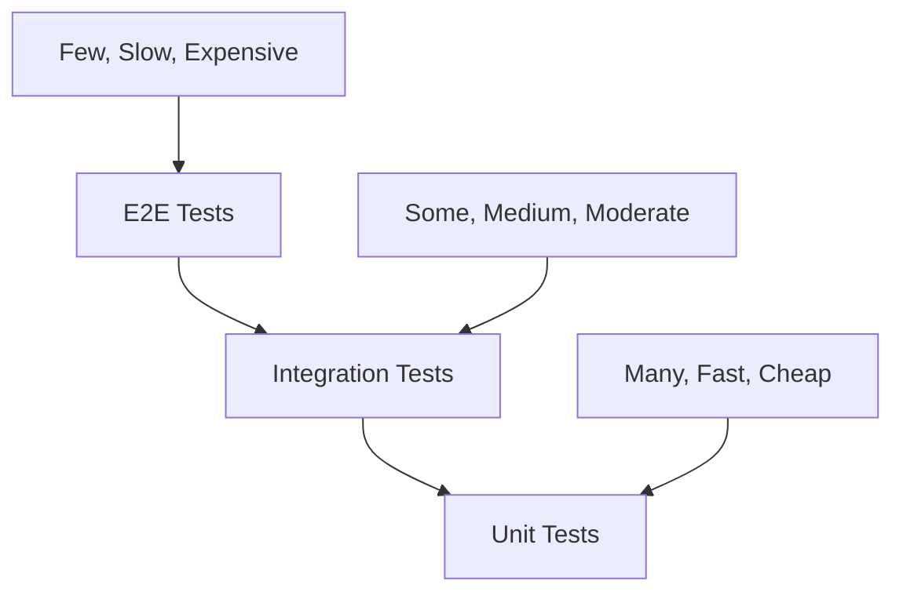

# 🧪 Testing Guide

This comprehensive testing guide covers all aspects of testing the LifeSmart Calculator, from unit tests to end-to-end testing and performance validation.

## Table of Contents

- [Testing Strategy](#testing-strategy)
- [Unit Testing](#unit-testing)
- [Integration Testing](#integration-testing)
- [End-to-End Testing](#end-to-end-testing)
- [Performance Testing](#performance-testing)
- [Accessibility Testing](#accessibility-testing)
- [Visual Regression Testing](#visual-regression-testing)
- [Security Testing](#security-testing)
- [Cross-Browser Testing](#cross-browser-testing)
- [Mobile Testing](#mobile-testing)
- [Test Data Management](#test-data-management)
- [Continuous Integration](#continuous-integration)
- [Test Reporting](#test-reporting)
- [Troubleshooting](#troubleshooting)

---

## Testing Strategy

### Testing Pyramid



### Testing Levels

1. **Unit Tests** (70%)
   - Individual functions and components
   - Fast execution
   - High coverage

2. **Integration Tests** (20%)
   - Component interactions
   - API integrations
   - Data flow

3. **End-to-End Tests** (10%)
   - Complete user workflows
   - Cross-browser validation
   - Real-world scenarios

### Quality Gates

- **Unit Test Coverage**: ≥ 80%
- **Integration Test Coverage**: ≥ 60%
- **E2E Test Coverage**: ≥ 40%
- **Performance Score**: ≥ 90 (Lighthouse)
- **Accessibility Score**: ≥ 95 (Lighthouse)

---

## Unit Testing

### Setup

#### Jest Configuration

```javascript
// jest.config.js
module.exports = {
  testEnvironment: 'jsdom',
  setupFilesAfterEnv: ['<rootDir>/src/setupTests.ts'],
  moduleNameMapping: {
    '^@/(.*)$': '<rootDir>/src/$1',
    '\\.(css|less|scss|sass)$': 'identity-obj-proxy',
    '\\.(gif|ttf|eot|svg|png)$': '<rootDir>/src/__mocks__/fileMock.js'
  },
  collectCoverageFrom: [
    'src/**/*.{ts,tsx}',
    '!src/**/*.d.ts',
    '!src/index.tsx',
    '!src/reportWebVitals.ts'
  ],
  coverageThreshold: {
    global: {
      branches: 80,
      functions: 80,
      lines: 80,
      statements: 80
    }
  }
};
```

#### Test Setup

```typescript
// src/setupTests.ts
import '@testing-library/jest-dom';
import { configure } from '@testing-library/react';

// Configure testing library
configure({ testIdAttribute: 'data-testid' });

// Mock Chart.js
jest.mock('chart.js', () => ({
  Chart: jest.fn(),
  registerables: []
}));

// Mock window.matchMedia
Object.defineProperty(window, 'matchMedia', {
  writable: true,
  value: jest.fn().mockImplementation(query => ({
    matches: false,
    media: query,
    onchange: null,
    addListener: jest.fn(),
    removeListener: jest.fn(),
    addEventListener: jest.fn(),
    removeEventListener: jest.fn(),
    dispatchEvent: jest.fn(),
  })),
});
```

### Component Testing

#### CreditCardCalculator Tests

```typescript
// src/components/__tests__/CreditCardCalculator.test.tsx
import React from 'react';
import { render, screen, fireEvent, waitFor } from '@testing-library/react';
import userEvent from '@testing-library/user-event';
import CreditCardCalculator from '../CreditCardCalculator';

describe('CreditCardCalculator', () => {
  const defaultProps = {
    monthlySpend: 2000,
    balanceCarried: 50,
    apr: 23
  };

  beforeEach(() => {
    jest.clearAllMocks();
  });

  describe('Rendering', () => {
    it('renders all input fields', () => {
      render(<CreditCardCalculator />);
      
      expect(screen.getByLabelText(/monthly spend/i)).toBeInTheDocument();
      expect(screen.getByLabelText(/balance carried/i)).toBeInTheDocument();
      expect(screen.getByLabelText(/apr/i)).toBeInTheDocument();
    });

    it('renders with default values', () => {
      render(<CreditCardCalculator />);
      
      expect(screen.getByDisplayValue('2000')).toBeInTheDocument();
      expect(screen.getByDisplayValue('50')).toBeInTheDocument();
      expect(screen.getByDisplayValue('23')).toBeInTheDocument();
    });

    it('renders results section', () => {
      render(<CreditCardCalculator />);
      
      expect(screen.getByText(/annual interest/i)).toBeInTheDocument();
      expect(screen.getByText(/monthly savings/i)).toBeInTheDocument();
    });
  });

  describe('User Interactions', () => {
    it('updates monthly spend input', async () => {
      const user = userEvent.setup();
      render(<CreditCardCalculator />);
      
      const input = screen.getByLabelText(/monthly spend/i);
      await user.clear(input);
      await user.type(input, '3000');
      
      expect(input).toHaveValue(3000);
    });

    it('updates balance carried slider', async () => {
      const user = userEvent.setup();
      render(<CreditCardCalculator />);
      
      const slider = screen.getByLabelText(/balance carried/i);
      await user.type(slider, '75');
      
      expect(slider).toHaveValue(75);
    });

    it('updates APR input', async () => {
      const user = userEvent.setup();
      render(<CreditCardCalculator />);
      
      const input = screen.getByLabelText(/apr/i);
      await user.clear(input);
      await user.type(input, '25');
      
      expect(input).toHaveValue(25);
    });
  });

  describe('Calculations', () => {
    it('calculates annual interest correctly', () => {
      render(<CreditCardCalculator />);
      
      // Test with default values: 2000 * 0.5 * 0.23 = 230
      expect(screen.getByText('$230')).toBeInTheDocument();
    });

    it('calculates monthly savings correctly', () => {
      render(<CreditCardCalculator />);
      
      // Test with default values: 230 / 12 = 19.17
      expect(screen.getByText('$19.17')).toBeInTheDocument();
    });

    it('updates calculations when inputs change', async () => {
      const user = userEvent.setup();
      render(<CreditCardCalculator />);
      
      const monthlySpendInput = screen.getByLabelText(/monthly spend/i);
      await user.clear(monthlySpendInput);
      await user.type(monthlySpendInput, '4000');
      
      // New calculation: 4000 * 0.5 * 0.23 = 460
      expect(screen.getByText('$460')).toBeInTheDocument();
    });
  });

  describe('Input Validation', () => {
    it('handles invalid input gracefully', async () => {
      const user = userEvent.setup();
      render(<CreditCardCalculator />);
      
      const input = screen.getByLabelText(/monthly spend/i);
      await user.clear(input);
      await user.type(input, 'invalid');
      
      // Should reset to 0 or show error
      expect(input).toHaveValue(0);
    });

    it('enforces minimum values', async () => {
      const user = userEvent.setup();
      render(<CreditCardCalculator />);
      
      const input = screen.getByLabelText(/monthly spend/i);
      await user.clear(input);
      await user.type(input, '-100');
      
      // Should enforce minimum value
      expect(input).toHaveValue(0);
    });

    it('enforces maximum values', async () => {
      const user = userEvent.setup();
      render(<CreditCardCalculator />);
      
      const input = screen.getByLabelText(/monthly spend/i);
      await user.clear(input);
      await user.type(input, '999999');
      
      // Should enforce maximum value
      expect(input).toHaveValue(100000);
    });
  });

  describe('Accessibility', () => {
    it('has proper labels for all inputs', () => {
      render(<CreditCardCalculator />);
      
      expect(screen.getByLabelText(/monthly spend/i)).toBeInTheDocument();
      expect(screen.getByLabelText(/balance carried/i)).toBeInTheDocument();
      expect(screen.getByLabelText(/apr/i)).toBeInTheDocument();
    });

    it('has proper ARIA attributes', () => {
      render(<CreditCardCalculator />);
      
      const slider = screen.getByLabelText(/balance carried/i);
      expect(slider).toHaveAttribute('aria-valuemin', '0');
      expect(slider).toHaveAttribute('aria-valuemax', '100');
    });

    it('supports keyboard navigation', async () => {
      const user = userEvent.setup();
      render(<CreditCardCalculator />);
      
      const firstInput = screen.getByLabelText(/monthly spend/i);
      const secondInput = screen.getByLabelText(/apr/i);
      
      await user.tab();
      expect(firstInput).toHaveFocus();
      
      await user.tab();
      expect(secondInput).toHaveFocus();
    });
  });
});
```

#### InvestmentChart Tests

```typescript
// src/components/__tests__/InvestmentChart.test.tsx
import React from 'react';
import { render, screen } from '@testing-library/react';
import InvestmentChart from '../InvestmentChart';

// Mock Chart.js
jest.mock('chart.js', () => ({
  Chart: jest.fn(),
  registerables: []
}));

describe('InvestmentChart', () => {
  const defaultProps = {
    monthlyContribution: 1000,
    annualRate: 8,
    timePeriod: 10
  };

  it('renders chart container', () => {
    render(<InvestmentChart {...defaultProps} />);
    
    expect(screen.getByTestId('investment-chart')).toBeInTheDocument();
  });

  it('renders with correct props', () => {
    render(<InvestmentChart {...defaultProps} />);
    
    // Chart should be created with correct data
    expect(Chart).toHaveBeenCalledWith(
      expect.any(HTMLCanvasElement),
      expect.objectContaining({
        data: expect.objectContaining({
          labels: expect.any(Array),
          datasets: expect.any(Array)
        })
      })
    );
  });

  it('handles missing props gracefully', () => {
    render(<InvestmentChart monthlyContribution={1000} />);
    
    // Should use default values
    expect(screen.getByTestId('investment-chart')).toBeInTheDocument();
  });

  it('updates when props change', () => {
    const { rerender } = render(<InvestmentChart {...defaultProps} />);
    
    // Change props
    rerender(<InvestmentChart {...defaultProps} annualRate={10} />);
    
    // Chart should be updated
    expect(Chart).toHaveBeenCalledTimes(2);
  });
});
```

### Utility Function Tests

```typescript
// src/utils/__tests__/calculations.test.ts
import {
  calculateAnnualInterest,
  calculateMonthlySavings,
  calculateInvestmentGrowth,
  formatCurrency,
  formatPercentage
} from '../calculations';

describe('Calculations', () => {
  describe('calculateAnnualInterest', () => {
    it('calculates correctly with valid inputs', () => {
      expect(calculateAnnualInterest(2000, 50, 23)).toBe(230);
      expect(calculateAnnualInterest(1000, 25, 15)).toBe(37.5);
      expect(calculateAnnualInterest(5000, 75, 30)).toBe(1125);
    });

    it('handles edge cases', () => {
      expect(calculateAnnualInterest(0, 50, 23)).toBe(0);
      expect(calculateAnnualInterest(2000, 0, 23)).toBe(0);
      expect(calculateAnnualInterest(2000, 50, 0)).toBe(0);
    });

    it('handles decimal inputs', () => {
      expect(calculateAnnualInterest(2000.50, 50.5, 23.5)).toBeCloseTo(237.12, 2);
    });
  });

  describe('calculateMonthlySavings', () => {
    it('calculates correctly with valid inputs', () => {
      expect(calculateMonthlySavings(230)).toBeCloseTo(19.17, 2);
      expect(calculateMonthlySavings(1200)).toBe(100);
      expect(calculateMonthlySavings(0)).toBe(0);
    });
  });

  describe('calculateInvestmentGrowth', () => {
    it('calculates correctly with valid inputs', () => {
      const result = calculateInvestmentGrowth(1000, 8, 10);
      
      expect(result).toHaveProperty('principal');
      expect(result).toHaveProperty('interest');
      expect(result).toHaveProperty('total');
      expect(result.principal).toBe(120000); // 1000 * 12 * 10
      expect(result.total).toBeGreaterThan(result.principal);
    });

    it('handles zero inputs', () => {
      const result = calculateInvestmentGrowth(0, 8, 10);
      
      expect(result.principal).toBe(0);
      expect(result.interest).toBe(0);
      expect(result.total).toBe(0);
    });
  });

  describe('formatCurrency', () => {
    it('formats numbers correctly', () => {
      expect(formatCurrency(1234.56)).toBe('$1,234.56');
      expect(formatCurrency(0)).toBe('$0.00');
      expect(formatCurrency(1000000)).toBe('$1,000,000.00');
    });

    it('handles negative numbers', () => {
      expect(formatCurrency(-1234.56)).toBe('-$1,234.56');
    });
  });

  describe('formatPercentage', () => {
    it('formats percentages correctly', () => {
      expect(formatPercentage(23)).toBe('23%');
      expect(formatPercentage(23.5)).toBe('23.5%');
      expect(formatPercentage(0)).toBe('0%');
    });
  });
});
```

---

## Integration Testing

### Component Integration Tests

```typescript
// src/__tests__/integration/CalculatorIntegration.test.tsx
import React from 'react';
import { render, screen, fireEvent, waitFor } from '@testing-library/react';
import userEvent from '@testing-library/user-event';
import CreditCardCalculator from '../../components/CreditCardCalculator';

describe('Calculator Integration', () => {
  it('updates chart when credit card inputs change', async () => {
    const user = userEvent.setup();
    render(<CreditCardCalculator />);
    
    // Change monthly spend
    const monthlySpendInput = screen.getByLabelText(/monthly spend/i);
    await user.clear(monthlySpendInput);
    await user.type(monthlySpendInput, '3000');
    
    // Wait for chart to update
    await waitFor(() => {
      expect(screen.getByTestId('investment-chart')).toBeInTheDocument();
    });
  });

  it('maintains data consistency across components', async () => {
    const user = userEvent.setup();
    render(<CreditCardCalculator />);
    
    // Change APR
    const aprInput = screen.getByLabelText(/apr/i);
    await user.clear(aprInput);
    await user.type(aprInput, '25');
    
    // Verify results update
    await waitFor(() => {
      expect(screen.getByText('$250')).toBeInTheDocument(); // 2000 * 0.5 * 0.25
    });
  });
});
```

### Data Flow Tests

```typescript
// src/__tests__/integration/DataFlow.test.tsx
import React from 'react';
import { render, screen, fireEvent } from '@testing-library/react';
import userEvent from '@testing-library/user-event';
import CreditCardCalculator from '../../components/CreditCardCalculator';

describe('Data Flow Integration', () => {
  it('propagates changes through all components', async () => {
    const user = userEvent.setup();
    render(<CreditCardCalculator />);
    
    // Change multiple inputs
    const monthlySpendInput = screen.getByLabelText(/monthly spend/i);
    const balanceCarriedSlider = screen.getByLabelText(/balance carried/i);
    const aprInput = screen.getByLabelText(/apr/i);
    
    await user.clear(monthlySpendInput);
    await user.type(monthlySpendInput, '4000');
    
    await user.type(balanceCarriedSlider, '75');
    
    await user.clear(aprInput);
    await user.type(aprInput, '30');
    
    // Verify all calculations update
    await waitFor(() => {
      expect(screen.getByText('$900')).toBeInTheDocument(); // 4000 * 0.75 * 0.30
    });
  });
});
```

---

## End-to-End Testing

### Playwright Setup

```typescript
// tests/e2e/calculator.spec.ts
import { test, expect } from '@playwright/test';

test.describe('LifeSmart Calculator', () => {
  test.beforeEach(async ({ page }) => {
    await page.goto('http://localhost:3000');
  });

  test('should load the calculator page', async ({ page }) => {
    await expect(page).toHaveTitle(/LifeSmart Calculator/);
    await expect(page.locator('h1')).toContainText('LifeSmart Calculator');
  });

  test('should calculate credit card interest', async ({ page }) => {
    // Test monthly spend input
    await page.fill('[data-testid="monthly-spend-input"]', '3000');
    
    // Test balance carried slider
    await page.fill('[data-testid="balance-carried-slider"]', '60');
    
    // Test APR input
    await page.fill('[data-testid="apr-input"]', '25');
    
    // Verify results
    await expect(page.locator('[data-testid="annual-interest"]')).toContainText('$450');
    await expect(page.locator('[data-testid="monthly-savings"]')).toContainText('$37.50');
  });

  test('should update investment chart', async ({ page }) => {
    // Change investment inputs
    await page.fill('[data-testid="time-period-input"]', '15');
    await page.fill('[data-testid="return-rate-input"]', '10');
    
    // Verify chart updates
    await expect(page.locator('[data-testid="investment-chart"]')).toBeVisible();
  });

  test('should handle invalid inputs', async ({ page }) => {
    // Test invalid monthly spend
    await page.fill('[data-testid="monthly-spend-input"]', 'invalid');
    
    // Should reset to 0
    await expect(page.locator('[data-testid="monthly-spend-input"]')).toHaveValue('0');
  });

  test('should be responsive on mobile', async ({ page }) => {
    await page.setViewportSize({ width: 375, height: 667 });
    
    // Verify mobile layout
    await expect(page.locator('[data-testid="calculator-container"]')).toBeVisible();
    
    // Test mobile interactions
    await page.fill('[data-testid="monthly-spend-input"]', '2000');
    await expect(page.locator('[data-testid="annual-interest"]')).toBeVisible();
  });

  test('should support keyboard navigation', async ({ page }) => {
    // Test tab navigation
    await page.keyboard.press('Tab');
    await expect(page.locator('[data-testid="monthly-spend-input"]')).toBeFocused();
    
    await page.keyboard.press('Tab');
    await expect(page.locator('[data-testid="apr-input"]')).toBeFocused();
  });

  test('should persist data in localStorage', async ({ page }) => {
    // Set values
    await page.fill('[data-testid="monthly-spend-input"]', '2500');
    await page.fill('[data-testid="balance-carried-slider"]', '40');
    await page.fill('[data-testid="apr-input"]', '20');
    
    // Reload page
    await page.reload();
    
    // Verify values are restored
    await expect(page.locator('[data-testid="monthly-spend-input"]')).toHaveValue('2500');
    await expect(page.locator('[data-testid="balance-carried-slider"]')).toHaveValue('40');
    await expect(page.locator('[data-testid="apr-input"]')).toHaveValue('20');
  });
});
```

### E2E Test Configuration

```typescript
// playwright.config.ts
import { defineConfig, devices } from '@playwright/test';

export default defineConfig({
  testDir: './tests/e2e',
  fullyParallel: true,
  forbidOnly: !!process.env.CI,
  retries: process.env.CI ? 2 : 0,
  workers: process.env.CI ? 1 : undefined,
  reporter: 'html',
  use: {
    baseURL: 'http://localhost:3000',
    trace: 'on-first-retry',
    screenshot: 'only-on-failure',
    video: 'retain-on-failure'
  },
  projects: [
    {
      name: 'chromium',
      use: { ...devices['Desktop Chrome'] }
    },
    {
      name: 'firefox',
      use: { ...devices['Desktop Firefox'] }
    },
    {
      name: 'webkit',
      use: { ...devices['Desktop Safari'] }
    },
    {
      name: 'Mobile Chrome',
      use: { ...devices['Pixel 5'] }
    },
    {
      name: 'Mobile Safari',
      use: { ...devices['iPhone 12'] }
    }
  ],
  webServer: {
    command: 'npm run serve',
    url: 'http://localhost:3000',
    reuseExistingServer: !process.env.CI
  }
});
```

---

## Performance Testing

### Lighthouse CI

```javascript
// .lighthouserc.json
{
  "ci": {
    "collect": {
      "numberOfRuns": 3,
      "url": ["http://localhost:3000"]
    },
    "assert": {
      "assertions": {
        "categories:performance": ["error", {"minScore": 0.9}],
        "categories:accessibility": ["error", {"minScore": 0.95}],
        "categories:best-practices": ["error", {"minScore": 0.9}],
        "categories:seo": ["error", {"minScore": 0.9}]
      }
    },
    "upload": {
      "target": "temporary-public-storage"
    }
  }
}
```

### Bundle Size Testing

```javascript
// .bundlesizerc.json
{
  "files": [
    {
      "path": "./build/static/js/*.js",
      "maxSize": "500 kB"
    },
    {
      "path": "./build/static/css/*.css",
      "maxSize": "50 kB"
    }
  ]
}
```

### Load Testing

```javascript
// load-test.js
import http from 'k6/http';
import { check, sleep } from 'k6';

export let options = {
  stages: [
    { duration: '2m', target: 100 },
    { duration: '5m', target: 100 },
    { duration: '2m', target: 200 },
    { duration: '5m', target: 200 },
    { duration: '2m', target: 0 }
  ]
};

export default function() {
  let response = http.get('http://localhost:3000');
  
  check(response, {
    'status is 200': (r) => r.status === 200,
    'response time < 500ms': (r) => r.timings.duration < 500,
    'content type is text/html': (r) => r.headers['Content-Type'].includes('text/html')
  });
  
  sleep(1);
}
```

---

## Accessibility Testing

### Automated Accessibility Tests

```typescript
// src/__tests__/accessibility/a11y.test.tsx
import React from 'react';
import { render } from '@testing-library/react';
import { axe, toHaveNoViolations } from 'jest-axe';
import CreditCardCalculator from '../../components/CreditCardCalculator';

expect.extend(toHaveNoViolations);

describe('Accessibility Tests', () => {
  it('should not have accessibility violations', async () => {
    const { container } = render(<CreditCardCalculator />);
    const results = await axe(container);
    expect(results).toHaveNoViolations();
  });

  it('should have proper heading structure', () => {
    render(<CreditCardCalculator />);
    
    const headings = document.querySelectorAll('h1, h2, h3, h4, h5, h6');
    expect(headings.length).toBeGreaterThan(0);
    
    // Check for proper heading hierarchy
    const h1 = document.querySelector('h1');
    expect(h1).toBeInTheDocument();
  });

  it('should have proper form labels', () => {
    render(<CreditCardCalculator />);
    
    const inputs = document.querySelectorAll('input');
    inputs.forEach(input => {
      const id = input.getAttribute('id');
      const label = document.querySelector(`label[for="${id}"]`);
      expect(label).toBeInTheDocument();
    });
  });

  it('should support keyboard navigation', () => {
    render(<CreditCardCalculator />);
    
    const focusableElements = document.querySelectorAll(
      'button, [href], input, select, textarea, [tabindex]:not([tabindex="-1"])'
    );
    
    expect(focusableElements.length).toBeGreaterThan(0);
  });
});
```

### Manual Accessibility Testing

```markdown
## Manual Accessibility Checklist

### Keyboard Navigation
- [ ] All interactive elements are reachable via keyboard
- [ ] Tab order is logical and intuitive
- [ ] Focus indicators are visible and clear
- [ ] No keyboard traps

### Screen Reader Support
- [ ] All content is readable by screen readers
- [ ] Proper heading structure (h1, h2, h3, etc.)
- [ ] Form labels are properly associated
- [ ] ARIA attributes are used correctly

### Visual Accessibility
- [ ] Sufficient color contrast (4.5:1 minimum)
- [ ] Text is readable at 200% zoom
- [ ] No information conveyed by color alone
- [ ] Focus indicators are visible

### Motor Accessibility
- [ ] Touch targets are at least 44px
- [ ] No hover-only interactions
- [ ] Adequate time for interactions
- [ ] No rapid flashing content
```

---

## Visual Regression Testing

### Screenshot Testing

```typescript
// tests/visual/visual.test.ts
import { test, expect } from '@playwright/test';

test.describe('Visual Regression Tests', () => {
  test('calculator page should match reference', async ({ page }) => {
    await page.goto('http://localhost:3000');
    await expect(page).toHaveScreenshot('calculator-page.png');
  });

  test('mobile layout should match reference', async ({ page }) => {
    await page.setViewportSize({ width: 375, height: 667 });
    await page.goto('http://localhost:3000');
    await expect(page).toHaveScreenshot('calculator-mobile.png');
  });

  test('dark mode should match reference', async ({ page }) => {
    await page.goto('http://localhost:3000');
    await page.click('[data-testid="theme-toggle"]');
    await expect(page).toHaveScreenshot('calculator-dark.png');
  });
});
```

---

## Security Testing

### Input Validation Tests

```typescript
// src/__tests__/security/input-validation.test.tsx
import React from 'react';
import { render, screen, fireEvent } from '@testing-library/react';
import userEvent from '@testing-library/user-event';
import CreditCardCalculator from '../../components/CreditCardCalculator';

describe('Input Validation Security', () => {
  it('should sanitize malicious input', async () => {
    const user = userEvent.setup();
    render(<CreditCardCalculator />);
    
    const input = screen.getByLabelText(/monthly spend/i);
    
    // Test XSS attempts
    await user.clear(input);
    await user.type(input, '<script>alert("xss")</script>');
    
    // Should not execute script
    expect(input.value).not.toContain('<script>');
  });

  it('should handle SQL injection attempts', async () => {
    const user = userEvent.setup();
    render(<CreditCardCalculator />);
    
    const input = screen.getByLabelText(/monthly spend/i);
    
    // Test SQL injection
    await user.clear(input);
    await user.type(input, "'; DROP TABLE users; --");
    
    // Should be treated as invalid input
    expect(input.value).toBe('0');
  });
});
```

---

## Cross-Browser Testing

### Browser Compatibility Matrix

| Feature | Chrome | Firefox | Safari | Edge |
|---------|--------|---------|--------|------|
| Basic Calculator | ✅ | ✅ | ✅ | ✅ |
| Chart Rendering | ✅ | ✅ | ✅ | ✅ |
| Local Storage | ✅ | ✅ | ✅ | ✅ |
| Responsive Design | ✅ | ✅ | ✅ | ✅ |
| Dark Mode | ✅ | ✅ | ✅ | ✅ |

### Cross-Browser Test Suite

```typescript
// tests/cross-browser/browser-compatibility.test.ts
import { test, expect } from '@playwright/test';

test.describe('Cross-Browser Compatibility', () => {
  test('should work in Chrome', async ({ page }) => {
    await page.goto('http://localhost:3000');
    await expect(page.locator('h1')).toBeVisible();
  });

  test('should work in Firefox', async ({ page }) => {
    await page.goto('http://localhost:3000');
    await expect(page.locator('h1')).toBeVisible();
  });

  test('should work in Safari', async ({ page }) => {
    await page.goto('http://localhost:3000');
    await expect(page.locator('h1')).toBeVisible();
  });

  test('should work in Edge', async ({ page }) => {
    await page.goto('http://localhost:3000');
    await expect(page.locator('h1')).toBeVisible();
  });
});
```

---

## Mobile Testing

### Mobile Test Scenarios

```typescript
// tests/mobile/mobile.test.ts
import { test, expect } from '@playwright/test';

test.describe('Mobile Testing', () => {
  test('should work on iPhone 12', async ({ page }) => {
    await page.setViewportSize({ width: 390, height: 844 });
    await page.goto('http://localhost:3000');
    
    // Test touch interactions
    await page.tap('[data-testid="monthly-spend-input"]');
    await page.fill('[data-testid="monthly-spend-input"]', '2000');
    
    // Verify results
    await expect(page.locator('[data-testid="annual-interest"]')).toBeVisible();
  });

  test('should work on Android', async ({ page }) => {
    await page.setViewportSize({ width: 412, height: 915 });
    await page.goto('http://localhost:3000');
    
    // Test swipe gestures
    await page.touchscreen.tap(200, 300);
    await page.fill('[data-testid="monthly-spend-input"]', '1500');
    
    // Verify results
    await expect(page.locator('[data-testid="annual-interest"]')).toBeVisible();
  });
});
```

---

## Test Data Management

### Test Data Factory

```typescript
// src/__tests__/utils/test-data-factory.ts
export interface TestData {
  monthlySpend: number;
  balanceCarried: number;
  apr: number;
  timePeriod: number;
  returnRate: number;
}

export const createTestData = (overrides: Partial<TestData> = {}): TestData => ({
  monthlySpend: 2000,
  balanceCarried: 50,
  apr: 23,
  timePeriod: 10,
  returnRate: 8,
  ...overrides
});

export const createEdgeCaseData = (): TestData[] => [
  createTestData({ monthlySpend: 0 }),
  createTestData({ monthlySpend: 100000 }),
  createTestData({ balanceCarried: 0 }),
  createTestData({ balanceCarried: 100 }),
  createTestData({ apr: 0 }),
  createTestData({ apr: 50 }),
  createTestData({ timePeriod: 1 }),
  createTestData({ timePeriod: 50 }),
  createTestData({ returnRate: 0 }),
  createTestData({ returnRate: 20 })
];
```

### Mock Data

```typescript
// src/__tests__/mocks/mock-data.ts
export const mockCalculationResults = {
  annualInterest: 230,
  monthlySavings: 19.17,
  investmentGrowth: {
    principal: 120000,
    interest: 11589,
    total: 131589
  }
};

export const mockChartData = {
  labels: ['Year 1', 'Year 2', 'Year 3'],
  datasets: [
    {
      label: 'Principal',
      data: [12000, 24000, 36000],
      borderColor: 'rgb(59, 130, 246)',
      backgroundColor: 'rgba(59, 130, 246, 0.1)'
    }
  ]
};
```

---

## Continuous Integration

### GitHub Actions Test Workflow

```yaml
# .github/workflows/test.yml
name: Test Suite

on:
  push:
    branches: [main, develop]
  pull_request:
    branches: [main]

jobs:
  test:
    runs-on: ubuntu-latest
    
    strategy:
      matrix:
        node-version: [18, 20]
        
    steps:
      - uses: actions/checkout@v4
      
      - name: Use Node.js ${{ matrix.node-version }}
        uses: actions/setup-node@v4
        with:
          node-version: ${{ matrix.node-version }}
          cache: 'npm'
          
      - name: Install dependencies
        run: npm ci
        
      - name: Run unit tests
        run: npm run test:coverage
        
      - name: Run integration tests
        run: npm run test:integration
        
      - name: Run E2E tests
        run: npm run test:e2e
        
      - name: Run accessibility tests
        run: npm run test:a11y
        
      - name: Upload coverage reports
        uses: codecov/codecov-action@v3
        with:
          file: ./coverage/lcov.info
```

---

## Test Reporting

### Coverage Reports

```json
// package.json
{
  "scripts": {
    "test:coverage": "jest --coverage --coverageReporters=text-lcov | coveralls",
    "test:coverage:html": "jest --coverage --coverageReporters=html",
    "test:coverage:ci": "jest --coverage --coverageReporters=lcov --coverageReporters=text"
  }
}
```

### Test Results Dashboard

```typescript
// src/__tests__/utils/test-reporter.ts
export class TestReporter {
  static generateReport(results: TestResults): string {
    return `
      # Test Results Report
      
      ## Summary
      - Total Tests: ${results.total}
      - Passed: ${results.passed}
      - Failed: ${results.failed}
      - Skipped: ${results.skipped}
      
      ## Coverage
      - Lines: ${results.coverage.lines}%
      - Functions: ${results.coverage.functions}%
      - Branches: ${results.coverage.branches}%
      - Statements: ${results.coverage.statements}%
      
      ## Performance
      - Average Test Time: ${results.performance.averageTime}ms
      - Slowest Test: ${results.performance.slowestTest}
      
      ## Accessibility
      - Violations: ${results.accessibility.violations}
      - Score: ${results.accessibility.score}
    `;
  }
}
```

---

## Troubleshooting

### Common Test Issues

#### 1. Chart.js Mocking Issues

**Problem**: Chart.js not properly mocked in tests
**Solution**:
```typescript
// src/setupTests.ts
jest.mock('chart.js', () => ({
  Chart: jest.fn().mockImplementation(() => ({
    destroy: jest.fn(),
    update: jest.fn(),
    resize: jest.fn()
  })),
  registerables: []
}));
```

#### 2. Async Test Issues

**Problem**: Tests failing due to async operations
**Solution**:
```typescript
// Use waitFor for async operations
import { waitFor } from '@testing-library/react';

test('should update after async operation', async () => {
  render(<Component />);
  
  await waitFor(() => {
    expect(screen.getByText('Updated')).toBeInTheDocument();
  });
});
```

#### 3. Memory Leaks in Tests

**Problem**: Tests causing memory leaks
**Solution**:
```typescript
// Clean up after each test
afterEach(() => {
  cleanup();
  jest.clearAllMocks();
});
```

### Performance Issues

#### 1. Slow Test Execution

**Problem**: Tests running too slowly
**Solutions**:
- Use `jest --runInBand` for sequential execution
- Mock heavy dependencies
- Use `test.only` for focused testing
- Optimize test data

#### 2. Flaky Tests

**Problem**: Tests failing intermittently
**Solutions**:
- Add proper waits and timeouts
- Use deterministic test data
- Mock external dependencies
- Increase retry count

---

## Conclusion

This comprehensive testing guide provides the foundation for maintaining high-quality, reliable code in the LifeSmart Calculator. By following these testing practices, you can ensure:

- **Reliability**: Tests catch bugs before they reach production
- **Maintainability**: Tests serve as living documentation
- **Performance**: Tests validate performance requirements
- **Accessibility**: Tests ensure inclusive user experience
- **Security**: Tests validate security measures

Remember to:
- Write tests early and often
- Keep tests simple and focused
- Maintain good test coverage
- Review and update tests regularly
- Use appropriate testing tools for each scenario

Happy testing! 🧪
